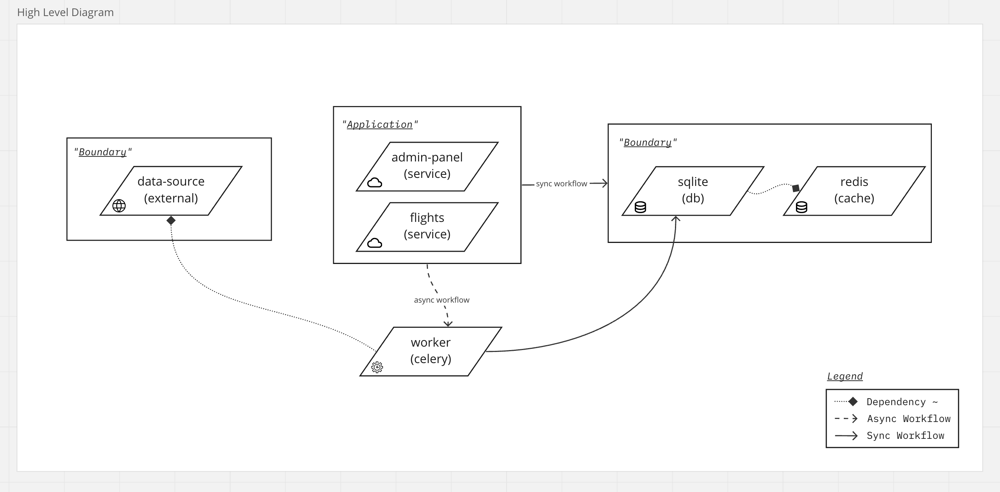

# Flights back-end recruitment test

This repo is a proposed solution to the **AuxoDev** backend take-home test. Problem statement can be found [here](docs/task.md).

---
## Architecture & Design 📖

Link to the [API Documentation](http://127.0.0.1:8000/redoc/). [Note: Not hosted yet]

#### Assumptions
1. The given url is the only source of data and it's good to have a robust solution to fetch and interact with this data.
2. The schema presented by the external data source will be maintained.
3. Authentication is not required for the API.
4. All airlines will have a different agent entity.


#### High Level Overview



The different components for this system and how they interact with each other is shown in the ~ C2 level. See more: [C4 diagrams](https://c4model.com/).

#### App Models [Generated]


    
#### Features
1. Pragmatic and well documented `Flights API` created from the given source of data.
2. Improved admin panel utility, including a way to fetch up-to-date data on demand and also schedule tasks for different usecases.

#### Improvements
1. Containerize the application when before starting to work in a team.
2. Try to achieve better code test coverage, follow TDD.
3. Separate development and production environments/dependencies.
4. Add secrets to environment variables.
5. Deploy in development/staging server. (Find an alternative to the heroku free tier 😜)
6. Add/explain folder structure in README.

---
## Getting Started 🚀


<!-- These should be installed in your device.
- python
- redis
- celery -->

Note: Make sure you have [python installed](https://www.python.org/downloads/)

Setup your dependencies:  
```sh

python3 -m venv env && source env/bin/activate && \
pip3 install -r requirements.txt
```

Start a redis server:
```sh
$ redis-server 
```

Run the application:
```sh
cd src && \ 
  python manage.py makemigrations && \
  python manage.py migrate && \
  python manage.py runserver
```

Run celery workers & beats (to run and schedule tasks):
```sh
cd src && \ 
    python -m celery -A config worker && \
    python -m celery -A config beat
```

Create a superuser:
```sh
$ python manage.py createsupersuer
```

Useful commands:
```sh
$ redis-cli monitor # monitor cache

$ python manage.py runserver_plus # better debugging tools
$ python manage.py shell_plus # auto import models in shell

$ pip install graphviz pyparsing && \ 
  python manage.py graph_models -a -o ../images/entity_diagram.png` # generate models diagram
```
---
### Running Tests 🧪

Run test in an app and check test coverage:
```sh
$ cd src
$ coverage run manage.py test flights
$ coverage html
$ open htmlcov/index.html
```
